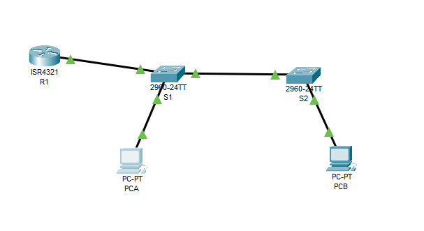

# VLAN и маршрутизация между VLAN

###  Задание:
Добавление сетей VLAN и назначение портов

###  Решение:
Part 1: Build the Network and Configure Basic Device Settings;

Part 2: Create VLANs and Assign Switch Ports;
Part 3: Configure an 802.1Q Trunk between the Switches;
Part 4: Configure Inter-VLAN Routing on the Router;
Part 5: Verify Inter-VLAN Routing is working.
